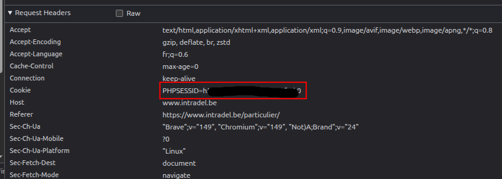

# Intradel integration

## Installations

- Through HACS [custom repositories](https://hacs.xyz/docs/faq/custom_repositories/) !
- Otherwise, download the zip from the latest release and copy `intradel` folder and put it inside
  your `custom_components` folder.

You can configure it through the UI using integration.

Authentication is done with a **session cookie** only. The Intradel login form is protected
by an invisible reCAPTCHA that the site verifies server-side, so a plain username/password
request is always rejected (`La vérification anti-spam a échoué`) — that method is therefore
not offered. Log in once in a regular browser and paste the resulting session cookie.

Capturing the cookie by hand is only needed once: the integration pings the site every
15 minutes so the session never goes stale, and the `intradel.set_cookie` service lets a
one-click bookmarklet hand over a fresh cookie without opening the developer tools. See
[docs/cookie-bookmarklet.md](docs/cookie-bookmarklet.md).

### How to get the session cookie

1. Open [https://www.intradel.be/particulier/](https://www.intradel.be/particulier/) in your
   browser and log in with your username, password and town.
2. Open the developer tools (`F12`, or right-click anywhere on the page and choose
   **Inspect**), then go to the **Network** tab.
3. Reload the page (`F5`) so a request to the site shows up in the list.
4. Click on the first request (e.g. `particulier` or `data.php`), open its **Headers**, and
   find the **Cookie** header under **Request Headers**.

   

5. Copy the full value of that header and paste it in the `Session cookie` field of the
   integration configuration.

The cookie is a session token: if it expires, the integration will ask you to repeat these
steps to provide a fresh one.

## Options

| Option | Default | Meaning |
| --- | --- | --- |
| Minutes between scans | 720 | How often the data is fetched. |
| Minutes between keep-alive pings | 15 | Keeps the session cookie alive; 0 disables it. |
| People in the household | 1 | Scales the per-person waste quotas. |
| Organic waste quota | 25 kg | Kilograms per person and per year covered by the annual fee. |
| Residual waste quota | 50 kg | Kilograms per person and per year covered by the annual fee. |
| Maximum bin collections | 30 | Yearly allowance of emptyings. |

The quotas are town-specific: check your own town's figures rather than trusting the
defaults.

## Provided entities

### organic/residual waste sensor

The `state` is total weight of waste of the **current year**.
The attribute `details` contains the details of bin collection (weight and date).
The attribute `start_date` is basically 01-01 of the current year.

### recyparc sensor

The `state` is the number of visit of the **current year**.
The attribute `details` contains the details of the visits (detail/volume and date) 
The attribute `start_date` is basically 01-01 of the current year.

---

